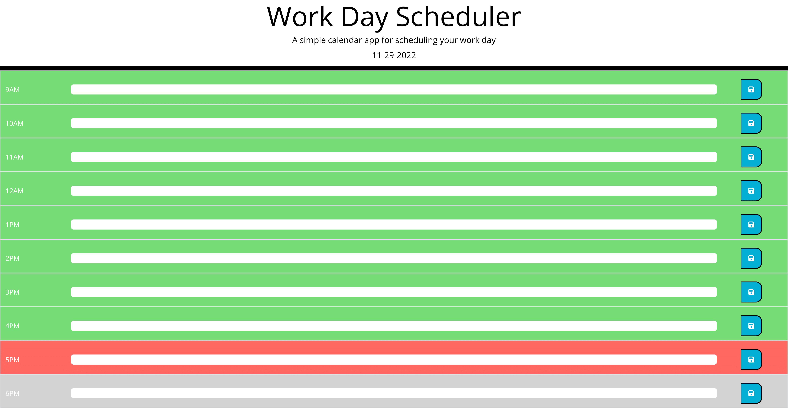

# Dj-WorkPlanner
## Description
This is a work planner that changes based on the time of day. It uses local storage to save the text inputed so it will remain if closed out and re-opened
## ScreenShot

## Link
[DeployedSite](https://dantallope.github.io/DJ_WorkPlanner/)